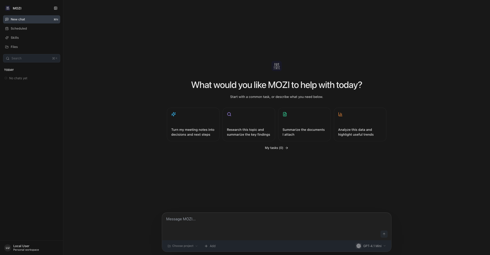
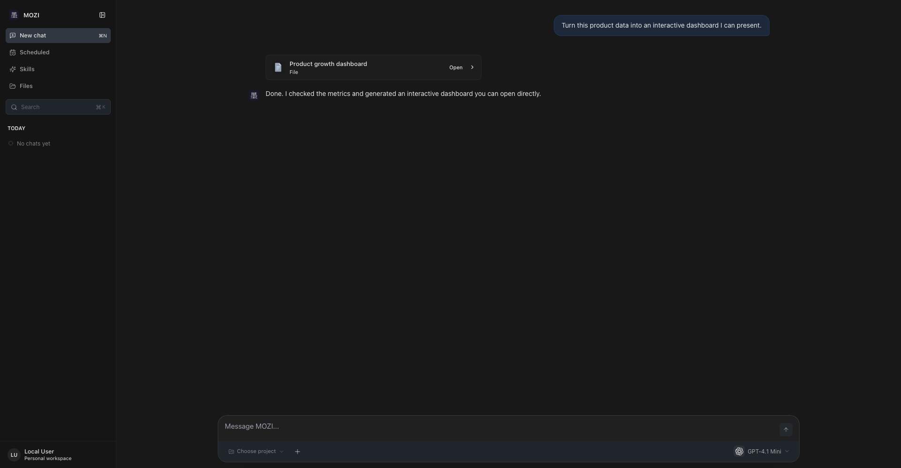

<p align="center">
  
</p>

<h1 align="center">OpenMozi</h1>

<p align="center">
  <a href="README.md">English</a> | <a href="README.zh-CN.md">简体中文</a>
</p>

> *Built for the hackers. A custom Agent OS heavily inspired by OpenClaw. Honestly, there's no grand vision here—I just wanted to build a hackable Agent OS from scratch to truly figure out how this stuff works under the hood.*

<p align="center">
  <strong>A personal AI agent that lives on your machine.</strong><br>
  It uses your tools, works in your projects, and delivers real files — not just chat.
</p>

<p align="center">
  <a href="LICENSE"></a>
  
  
</p>

---

## What is MOZI

MOZI is a desktop AI agent (think of a personal, self-hosted Codex) that runs entirely on your machine. You point it at a project folder, give it a task, and it executes: shell commands, file edits, web research, document generation. Every deliverable it claims is verified against the filesystem before it reports done — no fake success.

<p align="center">
  
</p>

The composer is the cockpit: pick a **project** (any folder or git repo), the **git branch** to work on, the **permission level** (read-only → full access), and the **model** — then describe what you want.

## What it can do

- **Code** — reads real repos, writes and edits files, runs tests, works on the branch you pick. A built-in branch switcher does honest `git switch` (never auto-stash, never force; conflicts abort with git's own message).
- **Documents** — generates Word / PowerPoint / Excel / PDF files and previews them **inside the app**: docx via a high-fidelity embedded viewer, spreadsheets as interactive grids, slides and PDFs with full CJK text. Hook up a local [ONLYOFFICE container](docker-compose.yml) and the preview upgrades to a full editor — optional, everything degrades gracefully without it.
- **Research** — searches the web, reads pages and files, and compiles findings into structured reports you can open as artifacts.
- **Remember** — long-term memory across sessions. Tell it something once; it's there next week.
- **Automate** — scheduled and recurring tasks with a dedicated UI, plus reusable task templates.
- **Skills** — 25 built-in skills (the [Anthropic official skill catalog](https://github.com/anthropics/skills) adapted to MOZI, plus MOZI's own). Skills load on demand: the model sees a one-line catalog and pulls full instructions only when a task needs them. Drop a `SKILL.md` into your workspace to add your own.

<p align="center">
  
</p>

*Above: an isolated synthetic demo used for documentation. It contains no real account, project, conversation, key, or machine data.*

## Get the App

The desktop app is the primary way to use MOZI. Build it from source (macOS, Apple Silicon):

```bash
git clone https://github.com/spytensor/OpenMozi.git
cd OpenMozi
pnpm install
pnpm desktop:pack:mac
# → desktop/dist/mac-arm64/MOZI.app  (drag into /Applications)
```

On first launch, create your local account and add an LLM API key. The app manages its own backend and data — no separate server to run. See [docs/DESKTOP-APP.md](docs/DESKTOP-APP.md) for details.

**Requirements:** Node.js ≥ 22 and pnpm to build. Optional extras: LibreOffice (slide/PDF conversion for previews), Docker (ONLYOFFICE editor-grade office viewing).

## Run as a server (optional)

MOZI also runs headless with a Web UI — same runtime, same features:

```bash
pnpm mozi onboard   # interactive setup: provider, API key
pnpm start          # Web UI at http://localhost:9210
```

Server-mode configuration lives in `~/.mozi/mozi.json` (JSON, not YAML). Inspect or change it with `pnpm mozi config get brain` / `pnpm mozi config set brain.model <model>`, or re-run `pnpm mozi onboard --update`.

## LLM Providers

MOZI works with any OpenAI-compatible API — 26 providers are in the catalog. Switch anytime without losing data or history.

| Provider | Setup | Notes |
|----------|-------|-------|
| **MiniMax** | `MINIMAX_API_KEY` | Default provider (MiniMax-M3) |
| **OpenAI** | `OPENAI_API_KEY` | GPT series |
| **Anthropic** | `ANTHROPIC_API_KEY` | Claude series |
| **Google Gemini** | `GEMINI_API_KEY` | Gemini Pro/Flash |
| **DeepSeek** | `DEEPSEEK_API_KEY` | DeepSeek V-series, R-series |
| **Moonshot** | `MOONSHOT_API_KEY` | Kimi models, long context |
| **Groq** | `GROQ_API_KEY` | Ultra-fast inference |
| **Ollama** | Local install | Fully local and private |
| | | …and 18 more (xAI, Mistral, Together, OpenRouter, NVIDIA, Bedrock, …) |

Regional endpoints are supported via `<PROVIDER>_BASE_URL` overrides.

## Architecture

```
You (Desktop app / Web UI)
  --> Gateway (sessions, auth, permission levels)
    --> Brain (LLM reasoning, planning, tool calls)
      --> Capabilities (shell, files, search, skills, sub-agents)
```

The LLM is the decision-maker; everything else is infrastructure that executes its decisions and reports the truth back. Deep dives:

- [Architecture Diagram](docs/architecture.svg)
- [Runtime Prompt Architecture](docs/RUNTIME-PROMPT-ARCHITECTURE.md)
- [Constitution](docs/CONSTITUTION.md)

## Development

```bash
pnpm dev          # backend watch mode
pnpm ui:dev       # Web UI dev server (hot reload)
pnpm test         # full test suite (vitest, real API calls)
pnpm desktop:dev  # desktop app in dev mode
```

```
src/
  core/          # Brain: LLM loop, model routing, provider failover
  gateway/       # sessions, auth, permission levels
  capabilities/  # shell, filesystem, search, vision
  skills/        # skill registry + 25 bundled SKILL.md assets
  memory/        # long-term memory, vector store
  store/         # SQLite (better-sqlite3)
ui/              # React + Vite desktop/web UI
desktop/         # Electron shell + packaging
```

Tech stack: TypeScript, Node.js 22, Fastify, better-sqlite3, Vercel AI SDK, React + Vite, Electron, Vitest.

## Contributing

Read [CONTRIBUTING.md](CONTRIBUTING.md) before opening an issue or pull request. Use the structured GitHub forms, report vulnerabilities privately, and never attach credentials or private data.

1. Read `AGENTS.md`, `CLAUDE.md`, and `docs/CONSTITUTION.md` for repository rules.
2. Run relevant tests and `pnpm verify:public-export` before submitting changes.
3. Commit convention: `feat:` / `fix:` / `refactor:` / `docs:` / `test:` / `chore:`.

## Releases

GitHub Actions are intentionally disabled. Releases are built and verified locally, then uploaded to [GitHub Releases](https://github.com/spytensor/OpenMozi/releases) with DMG, ZIP, SHA-256 checksums, and a release manifest. See [docs/RELEASE.md](docs/RELEASE.md).

## Acknowledgments

Deepest respect to the [OpenClaw](https://github.com/openclaw/openclaw) project, which served as the primary architectural inspiration for OpenMozi.

## License

OpenMozi's own source code is licensed under the [MIT License](LICENSE).

OpenMozi also depends on third-party software under its own terms. In particular,
the optional interactive React preview includes CodeSandbox Nodebox, which uses
the Sustainable Use License and restricts commercial use and distribution. See
[THIRD_PARTY_NOTICES.md](THIRD_PARTY_NOTICES.md) and the bundled license texts
before redistributing OpenMozi or using that preview commercially.

---

<p align="center">
  <sub>MOZI — an AI that works for you, not the other way around.</sub>
</p>
