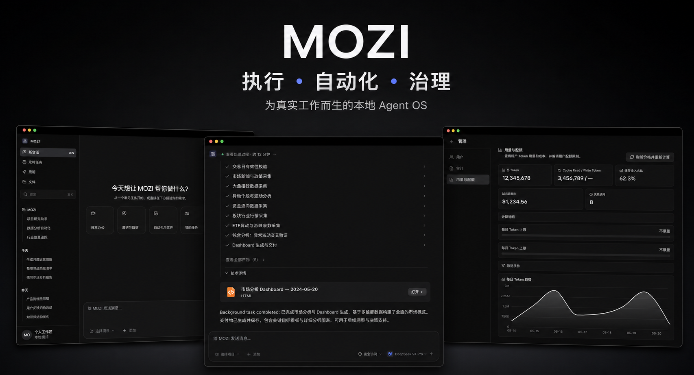

<p align="center">
  
</p>

<h1 align="center">OpenMozi</h1>

<p align="center">
  <a href="README.md">English</a> | <a href="README.zh-CN.md">简体中文</a>
</p>

> *没啥宏大的愿景，就是想手搓一个类似 OpenClaw 但更适合自己魔改的 Agent OS。致敬 OpenClaw，纯粹是为了搞通这一套底层运转的真实逻辑。*

<p align="center">
  <strong>住在你电脑里的个人 AI 助手。</strong><br>
  用你的工具、在你的项目里干活、交付真实的文件——不是清谈。
</p>

<p align="center">
  <a href="LICENSE"></a>
  
  
</p>

---

## MOZI 是什么

MOZI 是一个完全运行在你本机的桌面 AI Agent（可以理解为自托管的个人版 Codex）。选中一个项目文件夹、描述任务，它就去执行：跑 shell 命令、改文件、查资料、生成文档。它声称交付的每个产物都会先对照文件系统核验再报告完成——**不许假成功**。

<p align="center">
  
</p>

Composer 就是驾驶舱：选**项目**（任意文件夹或 git 仓库）、选要工作的 **git 分支**、选**权限级别**（只读 → 完全访问）、选**模型**，然后说需求。

## 它能做什么

- **写代码** — 读真实仓库、写改文件、跑测试，在你指定的分支上干活。内置分支切换器做的是诚实的 `git switch`（绝不自动 stash、绝不强切；冲突时用 git 自己的报错中止）。
- **做文档** — 生成 Word / PPT / Excel / PDF，并且**在应用内直接预览**：docx 走高保真内嵌查看器、表格是可交互网格、幻灯片和 PDF 中文完整。本地跑一个 [ONLYOFFICE 容器](docker-compose.yml)预览还能升级成完整编辑器——可选项，不跑也会优雅降级。
- **做调研** — 搜网页、读页面和文件，把发现整理成结构化报告，以产物形式打开。
- **有记忆** — 跨会话长期记忆。说过一次，下周还记得。
- **能定时** — 定时/循环任务有专门的 UI，还有可复用的任务模板。
- **有技能** — 25 个内置技能（[Anthropic 官方技能库](https://github.com/anthropics/skills)适配 MOZI 规范，加上 MOZI 自己的）。技能按需加载：模型平时只看到一行目录，任务需要时才拉取完整说明。往工作区丢一个 `SKILL.md` 就能加自己的技能。

## 获取应用

桌面应用是使用 MOZI 的主要方式。从源码构建（macOS，Apple Silicon）：

```bash
git clone https://github.com/spytensor/OpenMozi.git
cd OpenMozi
pnpm install
pnpm desktop:pack:mac
# → desktop/dist/mac-arm64/MOZI.app（拖进 /Applications）
```

首次启动时创建本地账号、填入 LLM API key 即可。应用自带后端和数据管理——不需要单独跑服务。详见 [docs/DESKTOP-APP.md](docs/DESKTOP-APP.md)。

**要求：** 构建需要 Node.js ≥ 22 和 pnpm。可选增强：LibreOffice（幻灯片/PDF 预览转换）、Docker（ONLYOFFICE 编辑器级 Office 查看）。

## 以服务方式运行（可选）

MOZI 也可以无界面运行，配 Web UI——同一套运行时、同样的功能：

```bash
pnpm mozi onboard   # 交互式配置：选 provider、填 API key
pnpm start          # Web UI 在 http://localhost:9210
```

服务模式的配置在 `~/.mozi/mozi.json`（JSON，不是 YAML）。用 `pnpm mozi config get brain` / `pnpm mozi config set brain.model <model>` 查改，或重跑 `pnpm mozi onboard --update`。

## LLM 提供商

MOZI 兼容任何 OpenAI 风格 API——目录里有 26 个提供商，随时切换，数据和历史不丢。

| 提供商 | 配置 | 备注 |
|--------|------|------|
| **MiniMax** | `MINIMAX_API_KEY` | 默认提供商（MiniMax-M3） |
| **OpenAI** | `OPENAI_API_KEY` | GPT 系列 |
| **Anthropic** | `ANTHROPIC_API_KEY` | Claude 系列 |
| **Google Gemini** | `GEMINI_API_KEY` | Gemini Pro/Flash |
| **DeepSeek** | `DEEPSEEK_API_KEY` | DeepSeek V 系 / R 系 |
| **Moonshot** | `MOONSHOT_API_KEY` | Kimi 模型，长上下文 |
| **Groq** | `GROQ_API_KEY` | 极速推理 |
| **Ollama** | 本地安装 | 完全本地、完全私有 |
| | | ……以及另外 18 家（xAI、Mistral、Together、OpenRouter、NVIDIA、Bedrock 等） |

国内平台可通过 `<PROVIDER>_BASE_URL` 覆盖区域端点。

## 架构

```
你（桌面应用 / Web UI）
  --> Gateway（会话、认证、权限级别）
    --> Brain（LLM 推理、规划、工具调用）
      --> Capabilities（shell、文件、搜索、技能、子代理）
```

LLM 是唯一的决策者；其余一切都是执行其决策、并把真实结果汇报回去的基础设施。深入阅读：

- [架构图](docs/architecture.svg)
- [运行时提示词架构](docs/RUNTIME-PROMPT-ARCHITECTURE.md)
- [Constitution](docs/CONSTITUTION.md)

## 开发

```bash
pnpm dev          # 后端 watch 模式
pnpm ui:dev       # Web UI 开发服务器（热更新）
pnpm test         # 全量测试（vitest，真实 API 调用）
pnpm desktop:dev  # 桌面应用开发模式
```

```
src/
  core/          # Brain：LLM 循环、模型路由、提供商故障切换
  gateway/       # 会话、认证、权限级别
  capabilities/  # shell、文件系统、搜索、视觉
  skills/        # 技能注册表 + 25 个内置 SKILL.md
  memory/        # 长期记忆、向量存储
  store/         # SQLite（better-sqlite3）
ui/              # React + Vite 桌面/网页 UI
desktop/         # Electron 壳 + 打包
```

技术栈：TypeScript、Node.js 22、Fastify、better-sqlite3、Vercel AI SDK、React + Vite、Electron、Vitest。

## 参与贡献

提交 Issue 或 PR 前请先阅读 [CONTRIBUTING.md](CONTRIBUTING.md)。请使用结构化 GitHub 表单，安全漏洞必须私下报告，禁止附带凭据或私人数据。

1. 先读 `AGENTS.md`、`CLAUDE.md` 和 `docs/CONSTITUTION.md` 了解仓库规则。
2. 提交前运行相关测试和 `pnpm verify:public-export`。
3. 提交信息约定：`feat:` / `fix:` / `refactor:` / `docs:` / `test:` / `chore:`。

## Release

GitHub Actions 有意保持关闭。Release 在本地完成构建和验证，再将 DMG、ZIP、SHA-256 校验文件及发布清单上传到 [GitHub Releases](https://github.com/spytensor/OpenMozi/releases)。详见 [docs/RELEASE.md](docs/RELEASE.md)。

## 致谢

向 [OpenClaw](https://github.com/openclaw/openclaw) 项目致以最深的敬意——它是 OpenMozi 最主要的架构灵感来源。

## 许可

OpenMozi 自有源代码采用 [MIT License](LICENSE)。

OpenMozi 同时依赖若干采用各自许可协议的第三方软件。尤其是可选的 React
交互预览包含 CodeSandbox Nodebox，其 Sustainable Use License 对商业使用与
分发有限制。重新分发 OpenMozi，或将该预览用于商业场景前，请阅读
[THIRD_PARTY_NOTICES.md](THIRD_PARTY_NOTICES.md) 及随包附带的完整许可文本。

---

<p align="center">
  <sub>MOZI——为你干活的 AI，而不是反过来。</sub>
</p>
